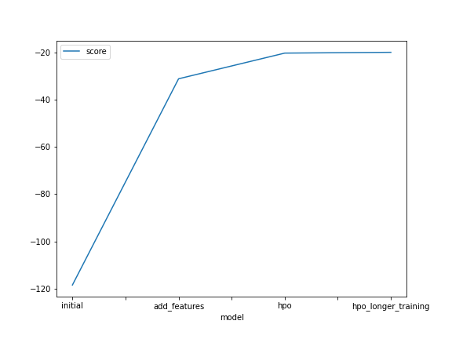
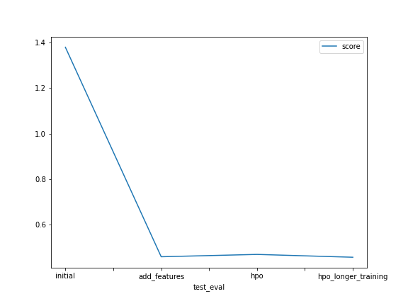

# Report: Predict Bike Sharing Demand with AutoGluon Solution
#### Mark Melling

## Initial Training
### What did you realize when you tried to submit your predictions? What changes were needed to the output of the predictor to submit your results?
The score was not good. 

### What was the top ranked model that performed?
The top ranked model, with a score of -118.456660, was RandomForestMSE_BAG_L1.

## Exploratory data analysis and feature creation
### What did the exploratory analysis find and how did you add additional features?
TODO: Add your explanation

### How much better did your model preform after adding additional features and why do you think that is?
The model performed considerably better. The best model was a WeightedEnsemble_L3 model with a score of -32.323917

## Hyper parameter tuning
### How much better did your model preform after trying different hyper parameters?
TODO: Add your explanation
- 

### If you were given more time with this dataset, where do you think you would spend more time?
TODO: Add your explanation
- Feature engineering
- Hyperparameter tuning

### Create a table with the models you ran, the hyperparameters modified, and the kaggle score.
|model|eval_metric|presets|training_time||score|
|--|--|--|--|--|
|initial|root_mean_squared_error|best_quality|600|1.37974|
|add_features|root_mean_squared_error|best_quality|600|0.45910|
|hpo|mean_absolute_error|best_quality|600|0.46934|
|hpo|root_mean_squared_error|best_quality|600|0.51804|
|hpo|r2|best_quality|600|0.51596|
|hpo|mean_absolute_error|best_quality|3600|0.45688|

I think hpo(n) are hyperparameters
- eval_metric
- training time
- model hyperparameters

### Create a line plot showing the top model score for the three (or more) training runs during the project.

TODO: Replace the image below with your own.

### Create a line plot showing the top kaggle score for the three (or more) prediction submissions during the project.

TODO: Replace the image below with your own.

## Summary
TODO: Add your explanation
- Getting the right features is critical
- Autogluon does a pretty good job of model and hyperparmeter selection

